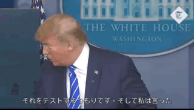

# PolySubs
Multilingual subtitle generator using Google's Speech to Text and Translation models
  This project was inspired by [TerribleHacks](https://terriblehack.website/) - our goal was to take a useful idea and build something  completely impractical out of it.

## Description
Learn new languages while watching your favourite videos!
 Polysubs generates subtitle for your videos with each block in a different language.

Video Languages Supported: English
  Subtitle Languages Supported: English, Spanish, Russian, Japanese

## Demo

Generation Process:
1. Convert the video to an audio format
2. Upload audio to Google Cloud Bucket for storage / analysis (Necessary for larger files)
3. Run Google's Speech to Text model to generate a subtitle file in English
4. Run Google's Translation model to translate subtitles into numerous languages

## Contributors
[James Meng](https://github.com/jmengo)
 
[Diego Chui](https://github.com/diegochui)
